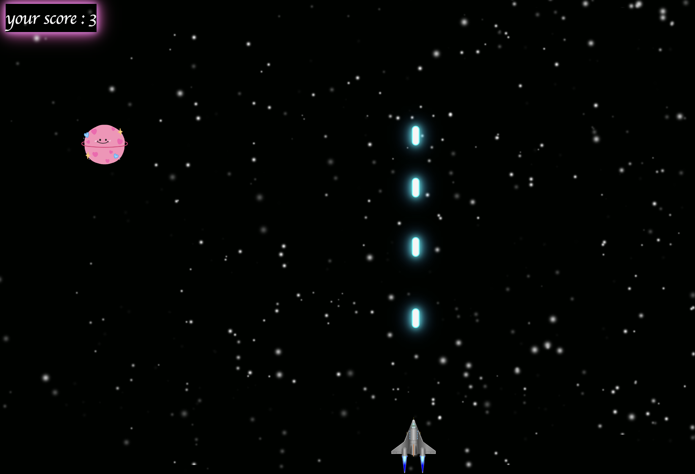

# SPACE GAME! ☄️ 🚀

welcome to my first game in js, you have to distroy all the planets that comes to your space ship!
please make sure to avoid them because you only have one life.

## INSTRUCTIONS
Goal: distroy all the plants and add more numbers to your score.
Score Boost: distroy the planets for an additional +1 point.

Obstacles: Avoid the falling planets, or it’s game over.

## NAVIGATION

Move: use your mouse to move the ship.

Shoot: use space button to shoot.
<a href="https://leen165.github.io/space-game-project1/">Click here to play!</a>

HAVE FUN playing!
thank you for being here! <3
